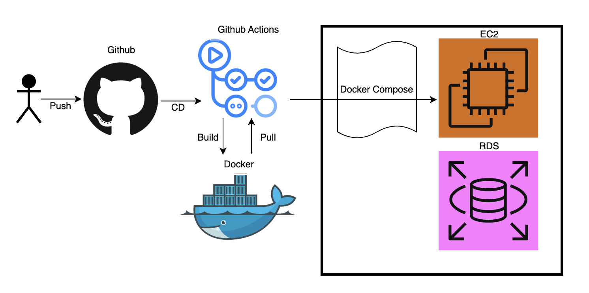
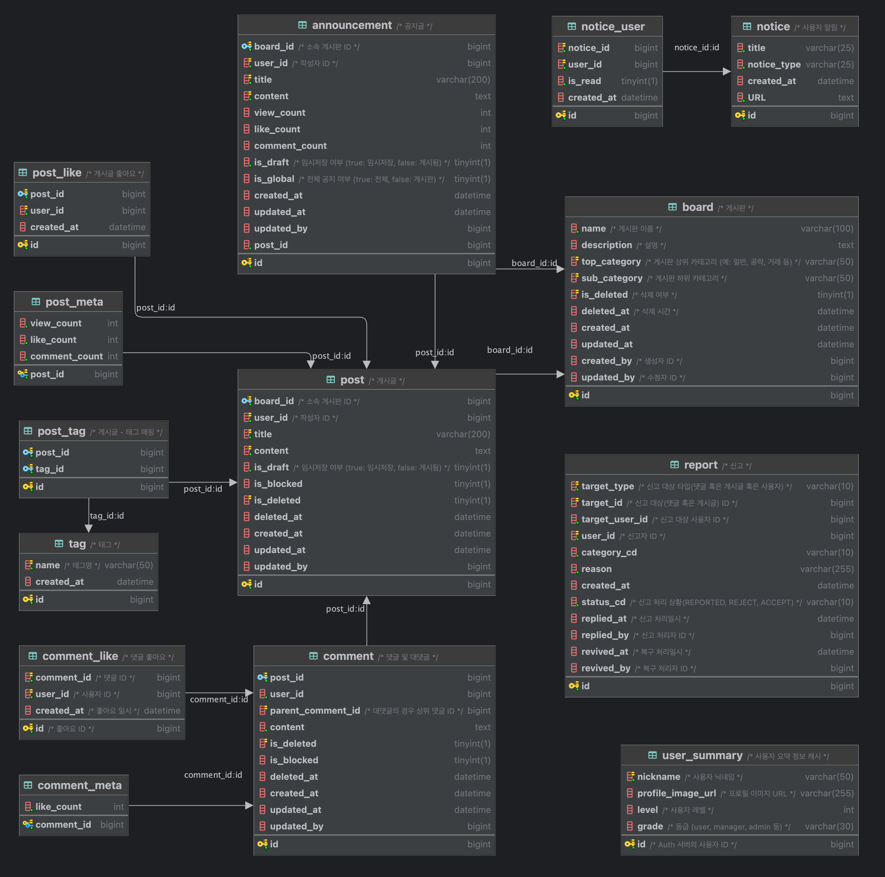

# devnogi-community-server

> **데브노기 커뮤니티 마이크로서비스**

---

## 1. 서비스 설명
**목적 및 기능**
- 데브노기의 커뮤니티 서비스를 위한 백엔드 마이크로서비스
- 주요 기능: 게시글 CRUD, 댓글 기능, 사용자 인증/권한 관리 등 (예시; 실제 구현된 기능 기반으로 작성)

**사용자가 얻는 가치**
- 안정적인 커뮤니티 경험 제공
- 빠른 응답성 및 확장 가능한 아키텍처 기반의 백엔드 서버 개발 및 운영

---

## 2. 기술 스택
- **Backend**: Java, Spring Boot, Spring Data JPA
- **Infra**: MySQL, Redis
- **Tools**: Gradle, Docker, Docker Compose, GitHub Actions
- **기타**: codecov, jacoco, spotless

---

## 3. 인프라 및 배포
- CI/CD 구조
    

---

## 4. 프로젝트 구조
```
src/main/java/until/the/eternity/dcs
│
├── common/
│	├── config/          # 설정 파일
│	├── entity/          # 공통 객체
│	├── exception/       # 공통 예외 처리
│	├── notification/    # 알림 중 공통 사용 부분
│	├── request/         # 공통 요청 DTO
│	└── response/        # 공통 응답 DTO
│
├── domain/
│	├── announcement/    # 공지글
│	├── board/           # 게시판
│	├── comment/         # 댓글
│	├── notice/          # 알림
│	├── post/            # 게시글
│	├── report/          # 신고
│	├── tag/             # 태그
│	└── user/            # 사용자
│
└── DcsApplication.java
```
- 아키텍처
  - 계층형 구조(Controller, Service, Repository)

---

## 5. API 문서
- Swagger를 통한 문서화
- Swagger 경로는 보안을 위해 내부에서만 공유

## 6. DB 스키마 / ERD

- ERD 다이어그램:

  

- 마이그레이션 관리
  - Flyway를 사용해 추적 관리